# RESULTS (WIP)

## PDB Targets

#### HSD11B1

https://github.com/michabirklbauer/protein_docking/tree/master/data/11-beta-hydroxysteroid_dehydrogenase_1

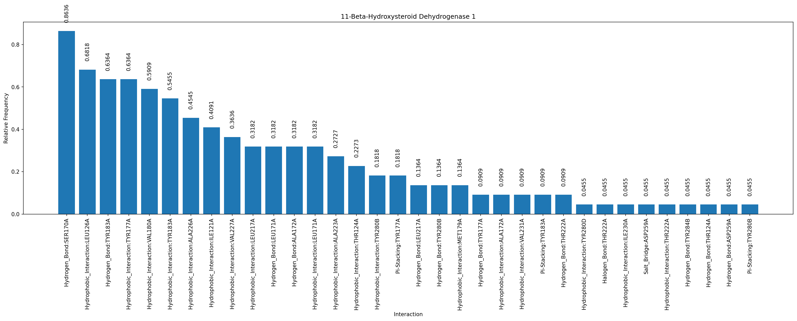

#### ACHE

https://github.com/michabirklbauer/protein_docking/tree/master/data/acetylcholinesterase

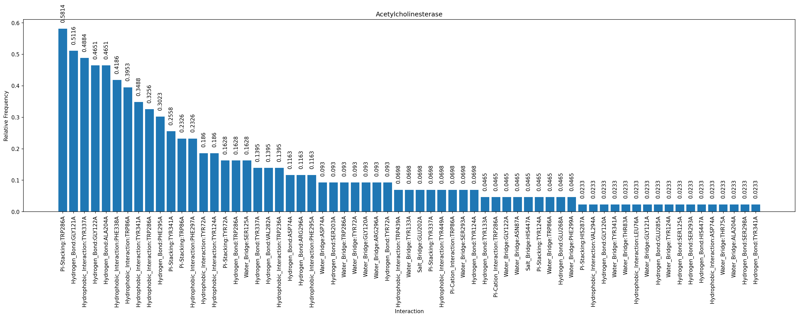

#### FXA

https://github.com/michabirklbauer/protein_docking/tree/master/data/coagulation_factor_xa

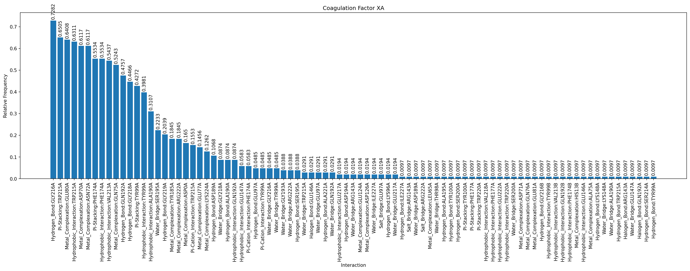

#### COX1

https://github.com/michabirklbauer/protein_docking/tree/master/data/cyclooxygenase-1

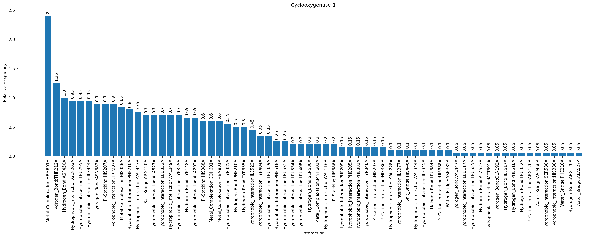

#### COX2

https://github.com/michabirklbauer/protein_docking/tree/master/data/cyclooxygenase-2

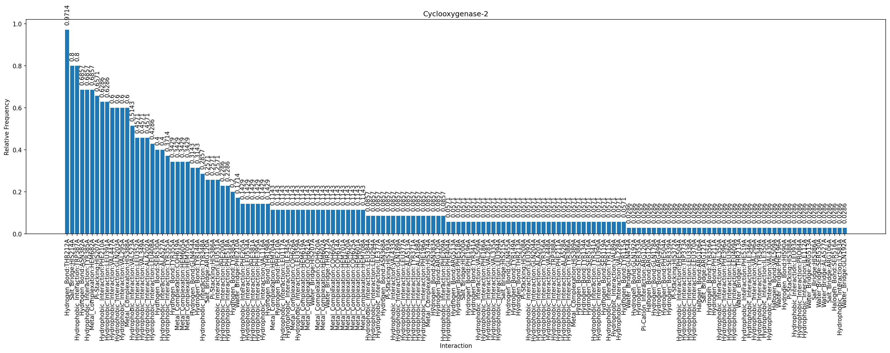

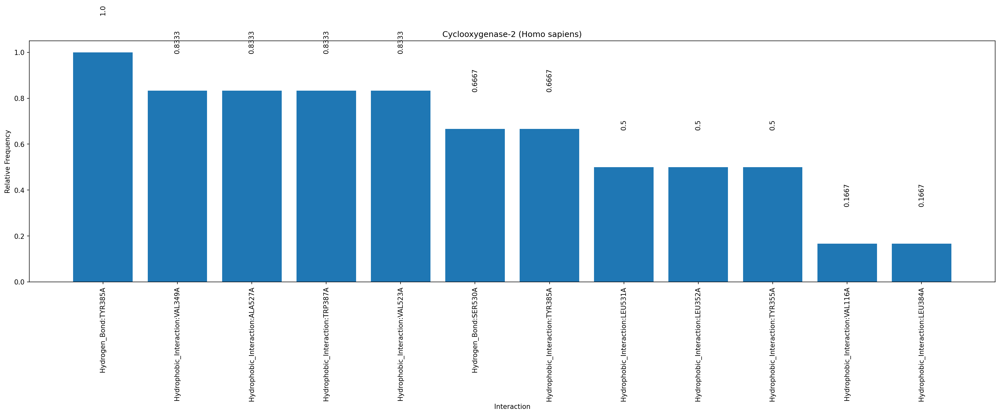

#### DPP4

https://github.com/michabirklbauer/protein_docking/tree/master/data/dipeptidyl_peptidase_IV

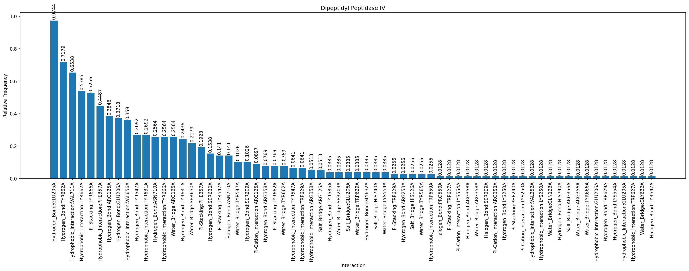

#### MAOB

https://github.com/michabirklbauer/protein_docking/tree/master/data/monoamine_oxidase_B

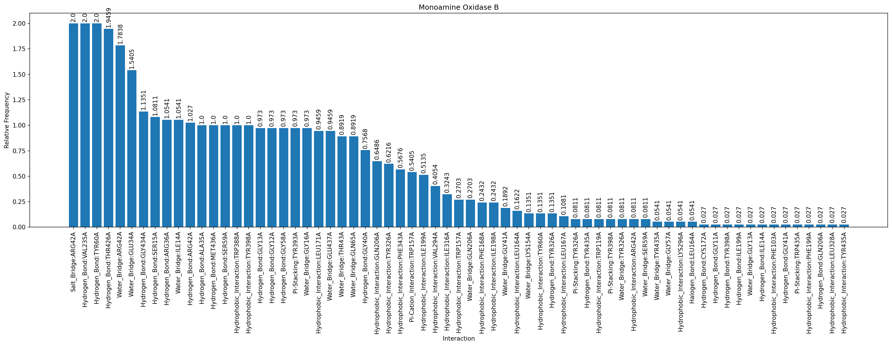

#### MAPK14

https://github.com/michabirklbauer/protein_docking/tree/master/data/p38_map_kinase

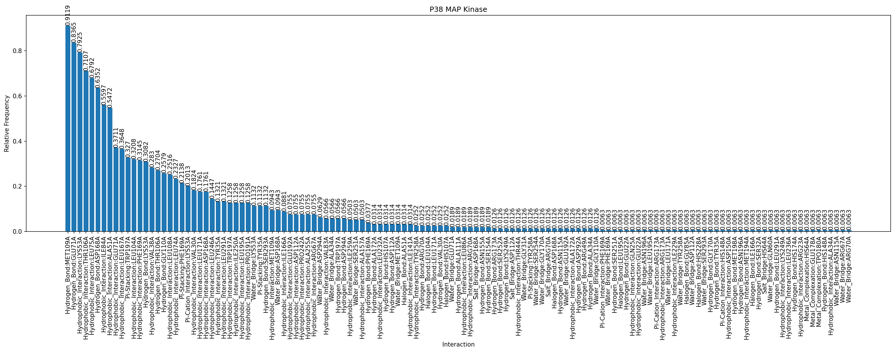

#### PDE5A

https://github.com/michabirklbauer/protein_docking/tree/master/data/phosphodiesterase-5

#### PTP1B

https://github.com/michabirklbauer/protein_docking/tree/master/data/protein-tyrosine_phosphatase_1B

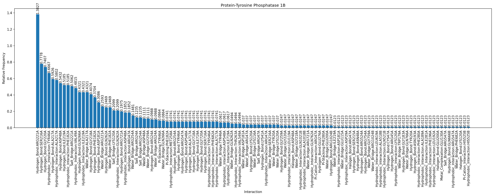

#### SEH

https://github.com/michabirklbauer/protein_docking/tree/master/data/soluble_epoxide_hydrolase

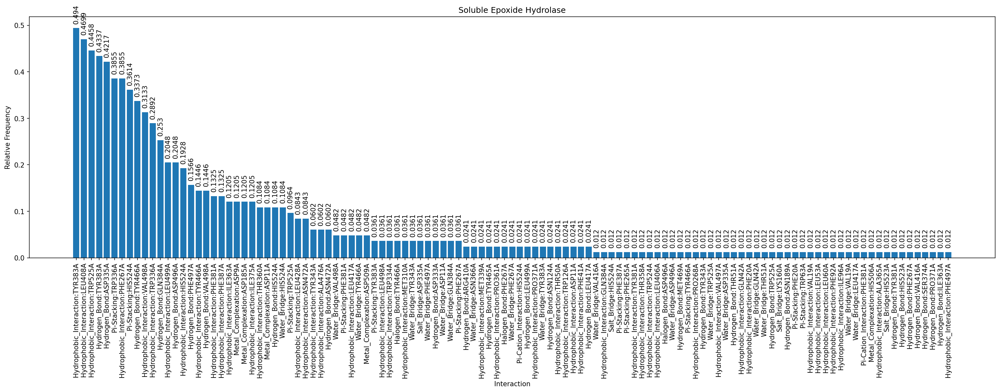

## SDF Workflow

https://github.com/michabirklbauer/protein_docking/tree/master/workflows/sdf

**All, Absolute**

**All, Normalized**

**Best, Absolute**

**Best, Normalized**

## Docking Comparison SEH

https://github.com/michabirklbauer/protein_docking/tree/master/workflows/vs

**Actives**

**Inactives**

**Comparison**

