# RESULTS (WIP)

## PDB Targets

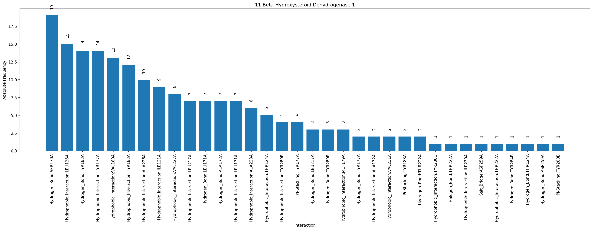
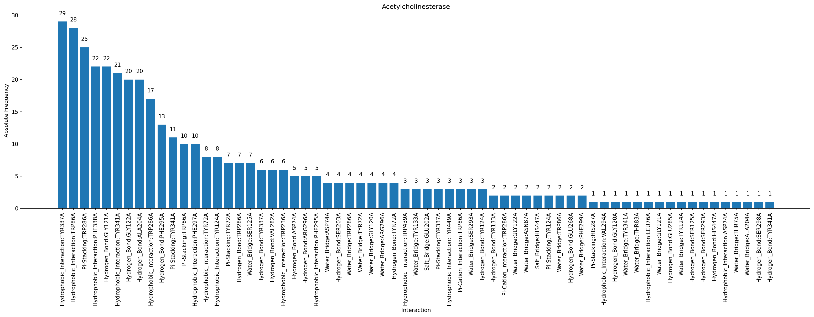
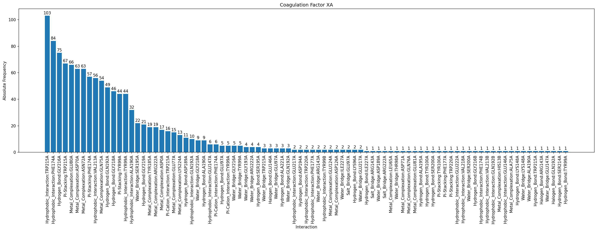
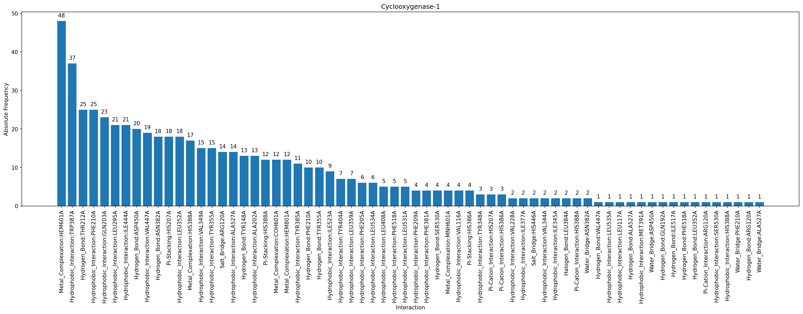
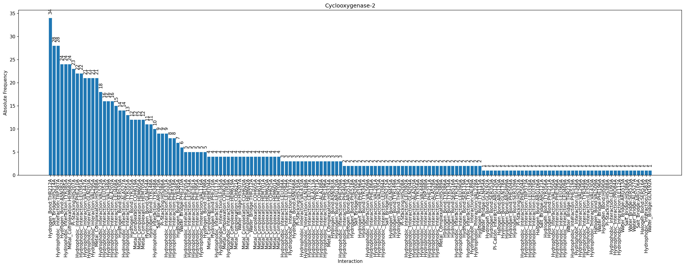
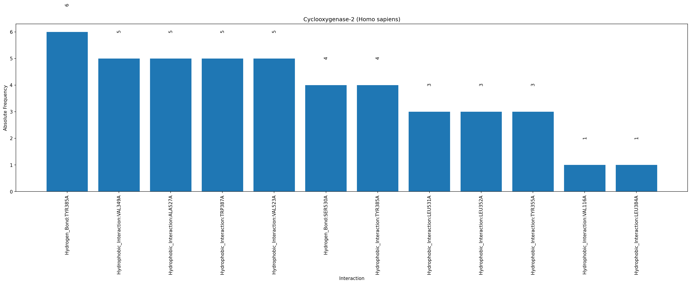

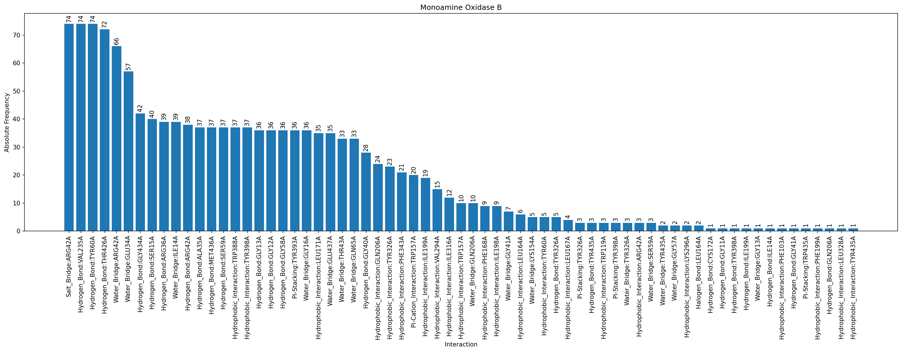
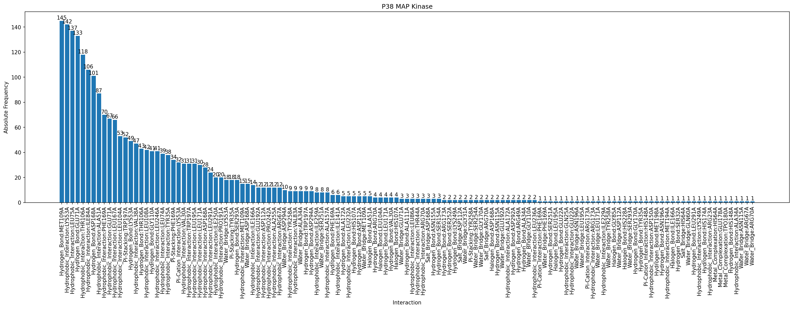
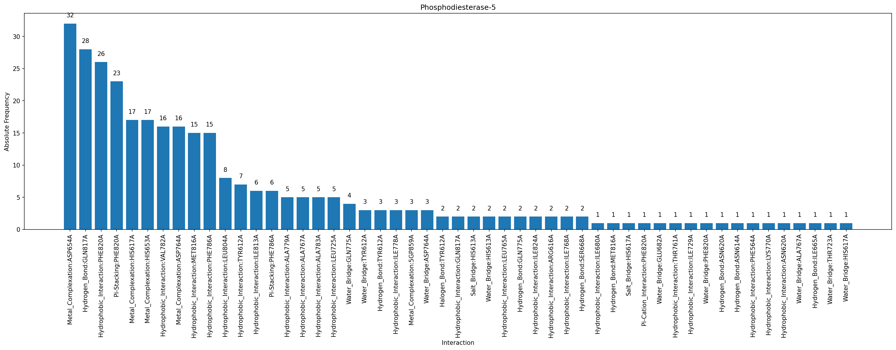

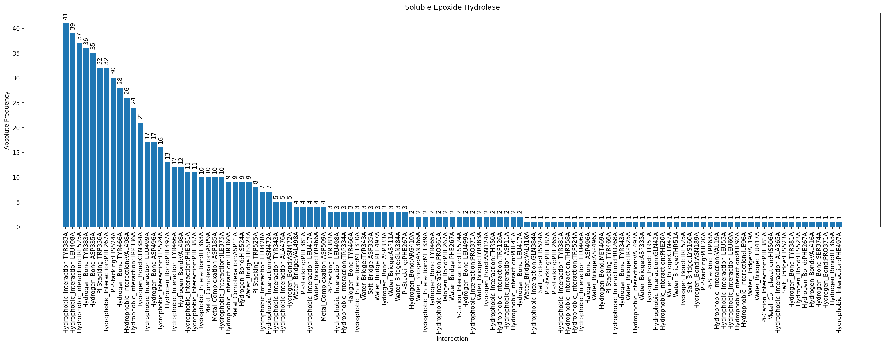

## SDF Workflow

**All, Absolute**

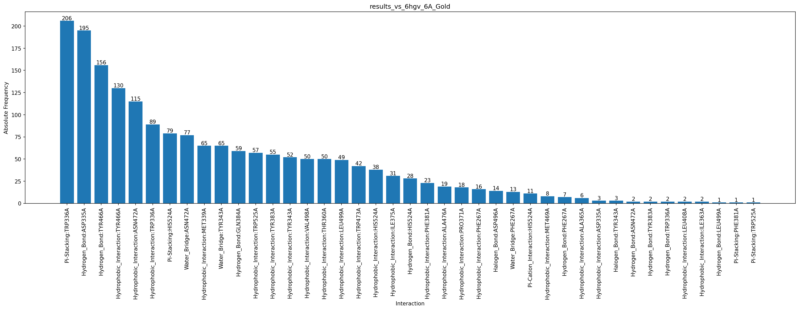

**All, Normalized**

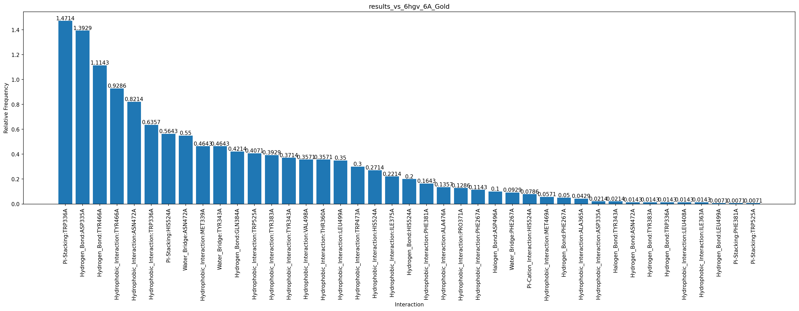

**Best, Absolute**

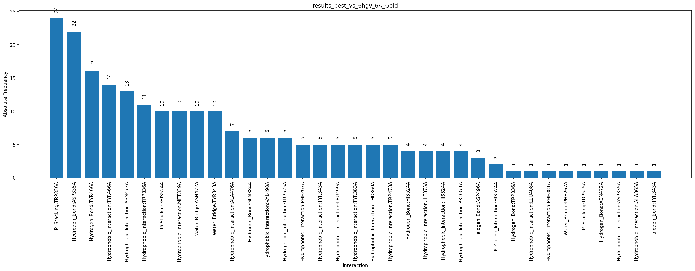

**Best, Normalized**

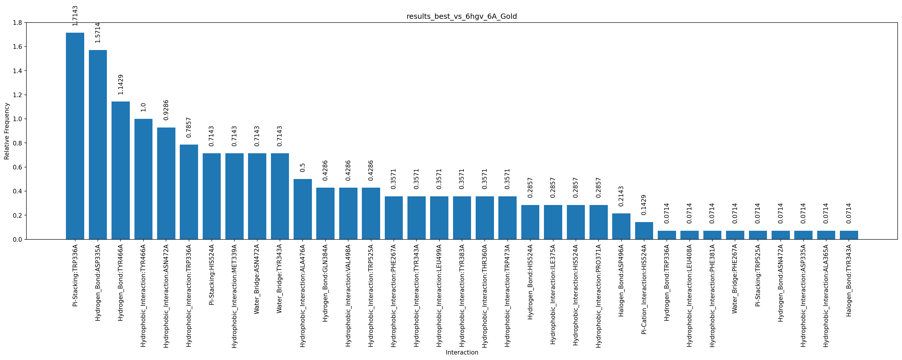

## Docking Comparison SEH

**Actives**

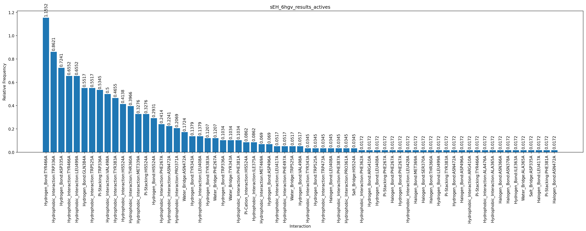

**Inactives**

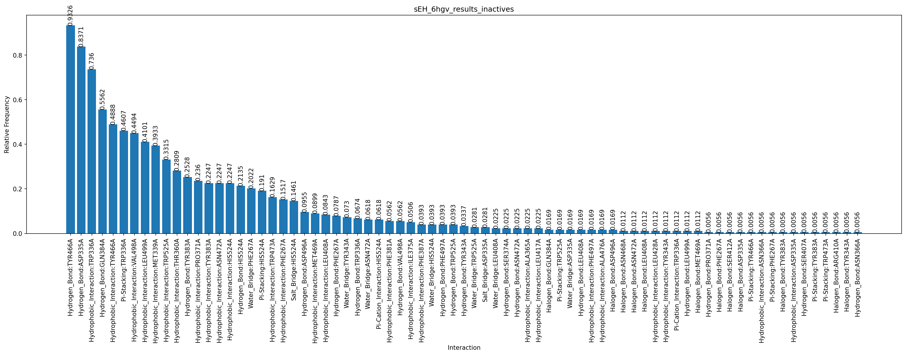

**Comparison**

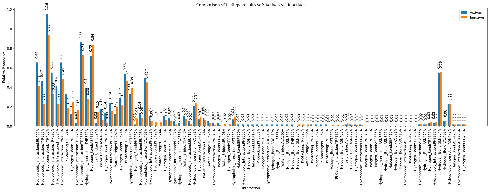
