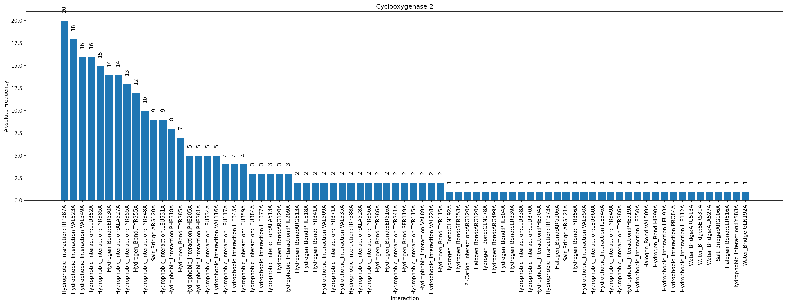
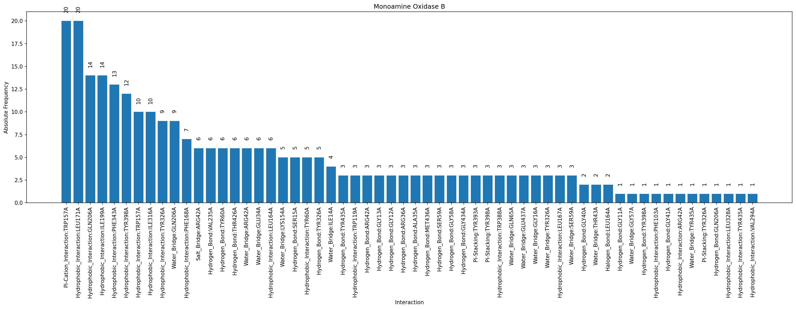
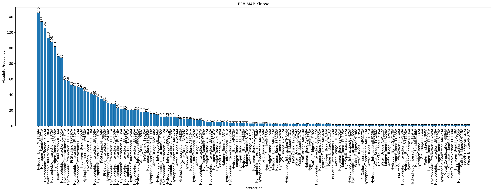
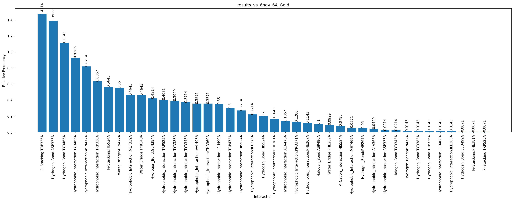

# RESULTS (WIP)

## PDB Targets

## SDF Workflow

**All, Absolute**

**All, Normalized**

**Best, Absolute**

**Best, Normalized**

## Docking Comparison SEH

**Actives**

**Inactives**

**Comparison**

