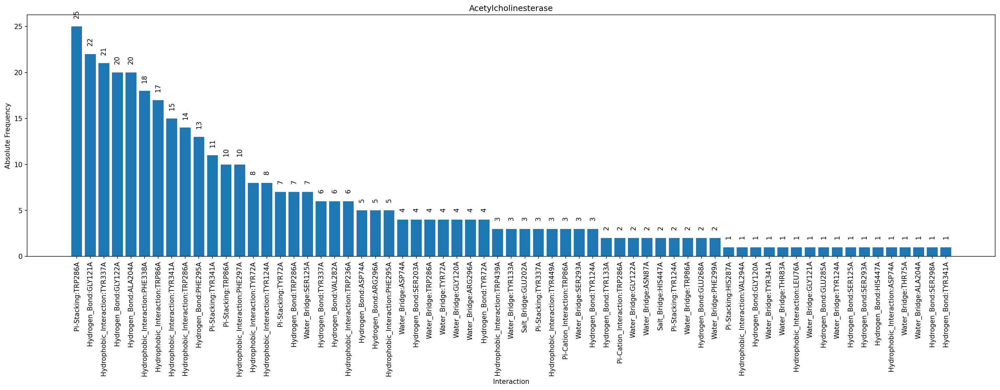
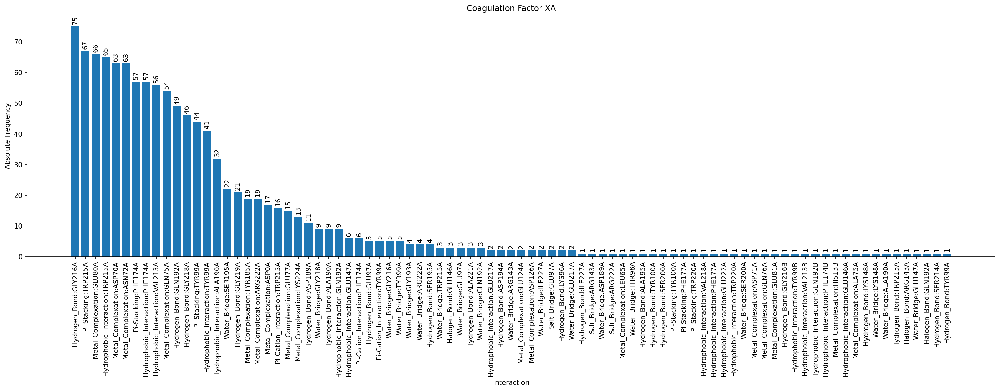
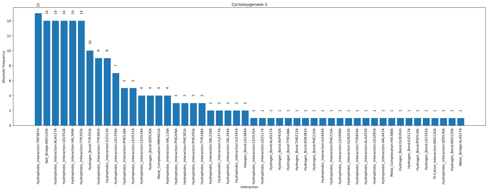
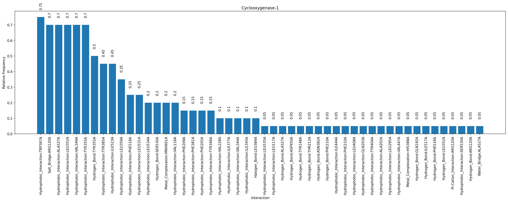
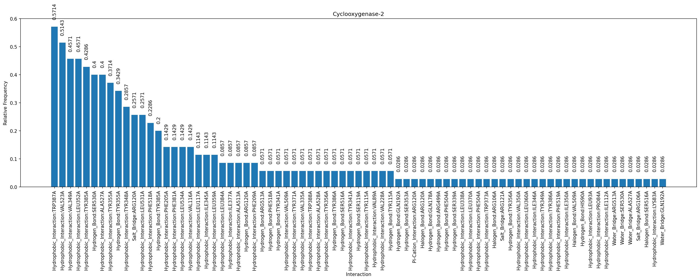
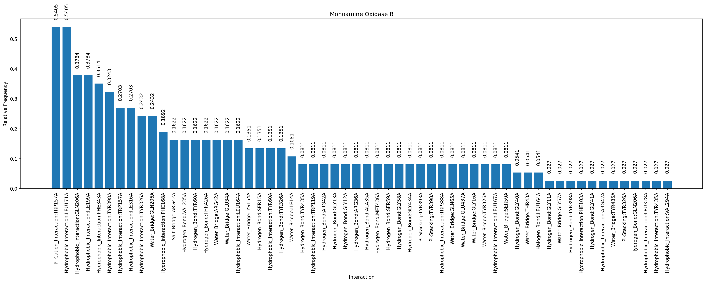
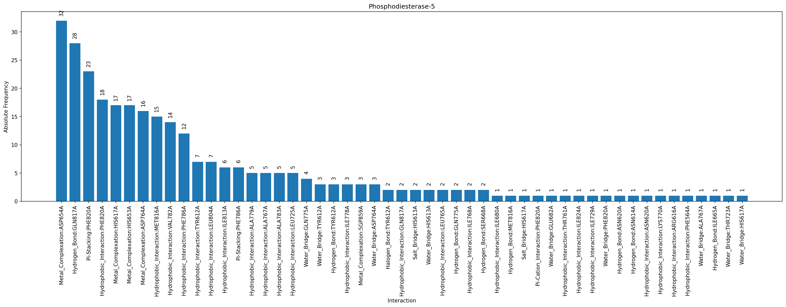
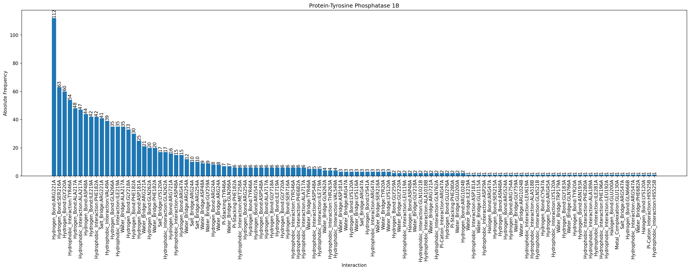

# RESULTS (WIP)

## PDB Targets

#### HSD11B1

https://github.com/michabirklbauer/protein_docking/tree/master/data/11-beta-hydroxysteroid_dehydrogenase_1

#### ACHE

https://github.com/michabirklbauer/protein_docking/tree/master/data/acetylcholinesterase

#### FXA

https://github.com/michabirklbauer/protein_docking/tree/master/data/coagulation_factor_xa

#### COX1

https://github.com/michabirklbauer/protein_docking/tree/master/data/cyclooxygenase-1

#### COX2

https://github.com/michabirklbauer/protein_docking/tree/master/data/cyclooxygenase-2

#### DPP4

https://github.com/michabirklbauer/protein_docking/tree/master/data/dipeptidyl_peptidase_IV

#### MAOB

https://github.com/michabirklbauer/protein_docking/tree/master/data/monoamine_oxidase_B

#### MAPK14

https://github.com/michabirklbauer/protein_docking/tree/master/data/p38_map_kinase

#### PDE5A

https://github.com/michabirklbauer/protein_docking/tree/master/data/phosphodiesterase-5

#### PTP1B

https://github.com/michabirklbauer/protein_docking/tree/master/data/protein-tyrosine_phosphatase_1B

#### SEH

https://github.com/michabirklbauer/protein_docking/tree/master/data/soluble_epoxide_hydrolase

## SDF Workflow

https://github.com/michabirklbauer/protein_docking/tree/master/workflows/sdf

**All, Absolute**

**All, Normalized**

**Best, Absolute**

**Best, Normalized**

## Docking Comparison SEH

https://github.com/michabirklbauer/protein_docking/tree/master/workflows/vs

**Actives**

**Inactives**

**Comparison**

